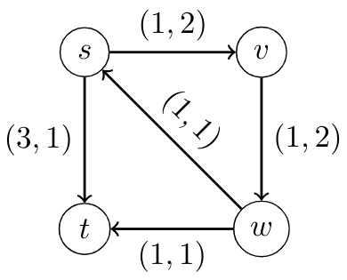

# Prediction Equilibrium for Dynamic Traffic Assignment

This file descibes how the results in the computational study can be reproduced.

## Getting Started

To start working:

* Install Python 3.8 (if not already)
* Install pipenv (if not already) `python3 -m pip install --user pipenv`
* Run `pipenv install`
* Run `pipenv shell` to create a shell session with an activated pipenv environment

Assertions are used extensively throughout the code and therefore slow down the computation a lot. Often, we use the
environment variable `PYTHONOPTIMIZE` to deactivate assert statements. Run the following code, to disable assertions for
a bash session:

```
export PYTHONOPTIMIZE=TRUE
```

### Running the Synthetic Network Scenario

This section shows how to deduce the results for the following sample network:



Here, we have a single source s and a single sink t. We introduce one commodity for each predictor and have the total
inflow split equally between them. This means that we measure, how the average travel times behave when the different
predictors compete in real-time with each other. As the instance is so small, we can have multiple runs very easily.
Hence, we measure how the average travel times behave when increasing the total network inflow.

To run the experiment, use the following command:

```
python src/main.py evaluate_sample
```

This generates a file `./avg_times_sample.json` with a json array `arr` of the following structure:

* `arr[0]` contains samples for the Zero predictor
* `arr[1]` contains samples for the constant predictor
* `arr[2]` contains samples for the linear predictor
* `arr[3]` contains samples for the regularized linear predictor
* `arr[4]` contains samples for the linear regression predictor

Furthermore, `arr[i]` is an array of samples with `arr[i][j]` being the measured average travel time of predictor `i`
in a network with total inflow `(j+1)*0.25`. Furthermore, a file `avg_times_sample.tikz` is created including a
tikz-diagram.

### Running the Sioux Falls and Tokyo Instances

This section explains how to reproduce the results for the tokyo network. In this example, we measure the performance of
the different predictors for random commodities. More specifically, for each random source-sink-pair `(s, t)`, we
introduce additional commodities - one for each predictor - with a very small network inflow rate (here 0.125).

To run each scenario the following steps are executed:

* Build training data: Multiple flows are generated with the constant predictor only up to some time horizon and saved
  into a folder `flows`. After that input samples of the model are extracted and saved to disk.
* Train the model(s): From the extracted training samples, we train the linear regression model(s) and save them to
  disk.
* Evaluate: Run the simulation with all available predictors including the learned predictor.

After evaluation of one source-sink-pair, the program saves a json file in the specified output folder. One such a json
file contains the computed average travel times of the predictors in the order as in the section above.

In some cases, the travel times of all predictors are the same. This can happen, if there is only a single (reasonable)
path to the sink or if no flow did not arrive during the observed time horizon. These entries were removed when creating
the boxplot in the paper.

To do the experiment for the Sioux-Falls-Network, run the following command:

```
python src/main.py run_sioux_falls ./data/SiouxFalls_net.tntp ./out/aaai-sioux-falls-scenario
```

For running the Tokyo Scenario:

```
python src/main.py run_tokyo ./data/tokyo_tiny.arcs ./data/tokyo_tiny.demands ./out/aaai-tokyo-scenario
```

As these experiments might take some time, the results for Sioux-Falls are pre-computed in the zip
file `./out/aaai-sioux-falls-scenario.zip`.
Because of size limits, intermediary results for tokyo were not attached in the supplementary material.
